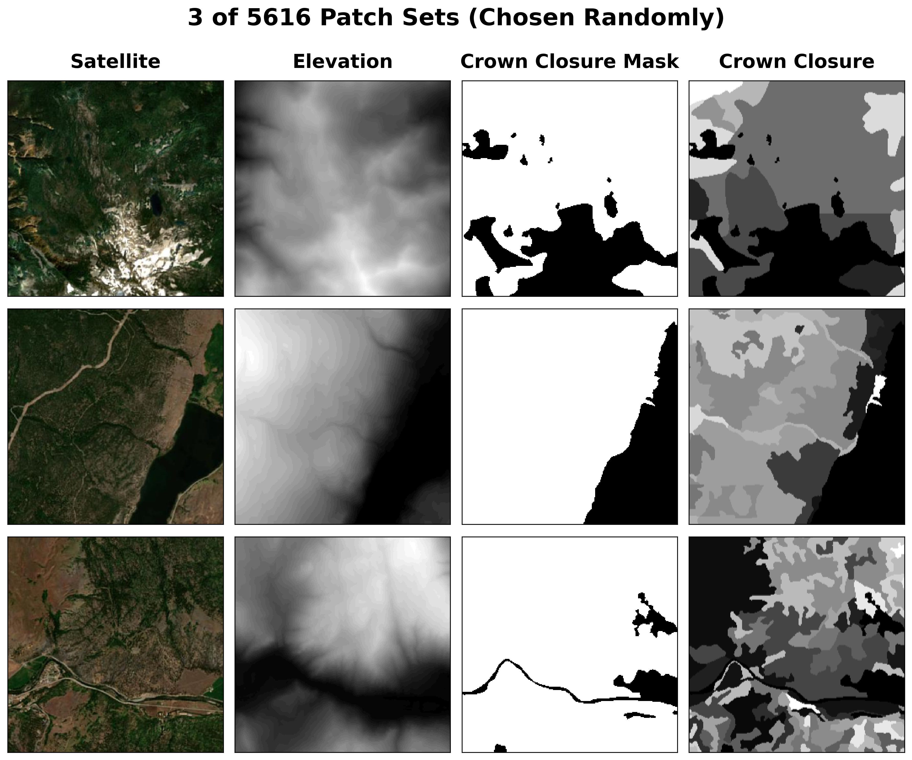

# Predicting Forest Crown Closure from Satellite Imagery and Elevation

Crown closure is the percentage of ground covered by the vertical projection of tree canopy, and it's a key input to forest management, wildfire risk, and habitat modelling. Measuring it on the ground is slow and expensive, so this project asks whether it can be predicted directly from satellite RGB imagery and elevation, checked against real ground-truth measurements from British Columbia's forest inventory.

Two models are compared on the same task, over the same area of interest (a ~668 km × ~350 km band of southern BC, lat 49-51°N): a linear regression baseline (RGB and elevation, with elevation entered as a polynomial), and a SegFormer vision transformer fine-tuned from a pretrained satellite-imagery checkpoint. The linear model reaches an R² of 0.28 (test RMSE ~20.3 percentage points of crown closure); SegFormer, trained for 20 epochs, gets the test RMSE down to ~13.1.

The area of interest is split into a 104 × 54 grid of 6.4 km patches (5,616 total, 25 m/pixel), each rendered as satellite RGB, elevation, crown closure, and a validity mask, so patches can be shuffled, split, and streamed independently rather than working with the whole region as one giant raster.


## Plots

**Predicted vs. true crown closure, sample patches:**


**SegFormer test RMSE across training epochs:**


**Crown closure and polygon area distributions across the BC Vegetation Resources Inventory:**
<p align="center">
  
  
</p>


## Data Sources

1. <a href="https://catalogue.data.gov.bc.ca/dataset/vri-forest-vegetation-composite-rank-1-layer-r1-" target="_blank" rel="noopener noreferrer">BC Vegetation Resources Inventory (VRI)</a>
    - Province-wide forest polygons with a `CROWN_CLOSURE` field, the ground-truth label for this project. Downloaded automatically as a ~4 GB File Geodatabase, clipped to the area of interest, then rasterized to a 25 m grid alongside a validity mask marking where a real (non-null) measurement exists.
2. <a href="https://pub.data.gov.bc.ca/datasets/175624/" target="_blank" rel="noopener noreferrer">BC Digital Elevation Model</a>
    - NTS 1:250,000 elevation tiles covering the area of interest, mosaicked into a single DEM and normalized against BC's true elevation range (0 m to 4,671 m, Mt. Fairweather) so every model input uses the same fixed scale.
3. <a href="https://s2maps.eu/" target="_blank" rel="noopener noreferrer">EOX s2cloudless (2025)</a>
    - A cloud-free Sentinel-2 satellite mosaic, loaded into QGIS as an XYZ tile layer and rendered patch by patch to produce the RGB input images.
4. <a href="https://huggingface.co/Pranilllllll/segformer-satellite-segementation" target="_blank" rel="noopener noreferrer">SegFormer-B0, pretrained on satellite imagery</a>
    - Starting checkpoint for the SegFormer model. Fine-tuned on real satellite tiles (not natural photos, unlike most public SegFormer checkpoints), so its RGB features transfer more directly. Adapted here by expanding the first conv layer to take a 4th (elevation) channel and swapping its classifier for a single-channel regression head.


## Project Structure
```
CABIN/
├── code/
│   ├── generate_dem.py                     # Downloads and mosaics the BC DEM
│   ├── generate_crown_closure.py           # Downloads the VRI, clips + rasterizes crown closure
│   ├── generate_crown_closure_histograms.py  # Polygon area / crown closure distribution plots
│   ├── generate_sentinel2.py               # Adds the Sentinel-2 layer to the QGIS project
│   ├── generate_patch_images.py            # Renders the AOI into 5,616 RGB/elevation/crown-closure/mask patches
│   ├── generate_patch_summaries.py         # Flattens each patch into a per-pixel CSV for regression
│   ├── generate_prediction_mosaics.py      # Runs both trained models across every patch, mosaics the results
│   ├── linear_regression_trainer.ipynb     # Fits and evaluates the linear regression baseline
│   └── segformer_trainer.ipynb             # Fine-tunes and evaluates the SegFormer model
├── datasets/                               # Generated data (gitignored, rebuilt by the scripts above)
│   ├── DEM.tif
│   ├── crown_closure_raster/
│   ├── crown_closure_mask/
│   ├── crown_closure_polygons.gpkg
│   ├── crown_closure_pred_linear_mosaic/   # Linear model's predictions, whole AOI
│   ├── crown_closure_pred_segformer_mosaic/  # SegFormer's predictions, whole AOI
│   └── patches/                            # Per-patch imagery, CSVs, and predictions
├── models/
│   ├── linear_regression_coefs_testrmse*.csv   # Fitted coefficients, p-values, R²
│   └── segformer_crown_closure_epoch*/         # One checkpoint per training epoch
├── plots/                                  # Exported figures
├── area_of_interest_visualizer.qgz         # QGIS project tying all the layers together
└── README.md                               # This file
```
