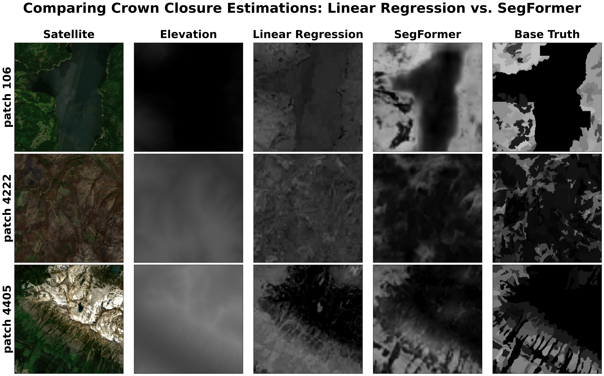
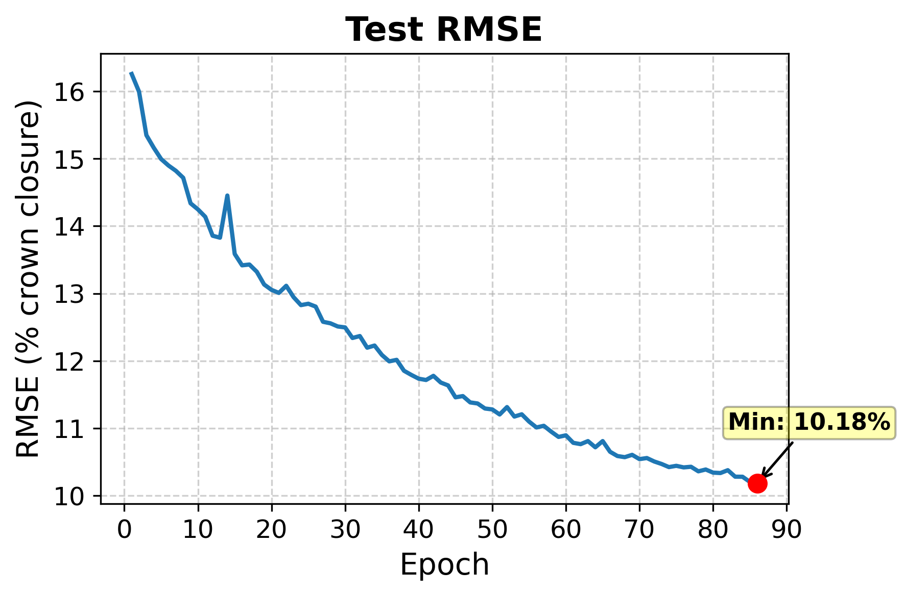
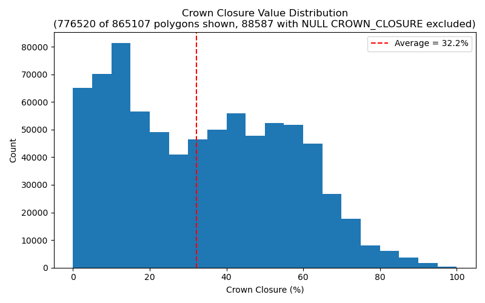
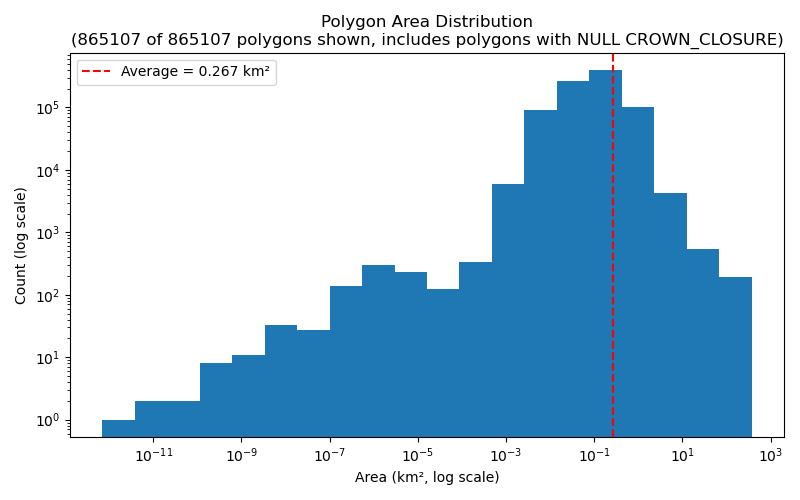

# Predicting Forest Crown Closure from Satellite Imagery and Elevation

Crown closure is the percentage of ground covered by the vertical projection of tree canopy, and it's a key input to forest management, wildfire risk, and habitat modelling. Measuring it on the ground is slow and expensive, so this project asks whether it can be predicted directly from satellite RGB imagery and elevation, checked against real ground-truth measurements from British Columbia's forest inventory.

Two models are compared on the same task, over the same area of interest (a ~668 km × ~350 km band of southern BC, latitude 49-51°N, longitude 119-125°W): a linear regression baseline (RGB and elevation, with elevation entered as a polynomial), and a SegFormer vision transformer fine-tuned from a pretrained satellite-imagery checkpoint.

| Model | Test RMSE (crown closure, %) | Inference time/image |
|---|---|---|
| Linear regression | ~20.3 | ~0.39 ms |
| SegFormer (86 epochs so far) | ~10.2 | ~6.26 ms |

The area of interest is split into a 104 × 54 grid of 6.4 km patches (5,616 total, 25 m/pixel), each rendered as satellite RGB, elevation, crown closure, and a validity mask, so patches can be shuffled, split, and streamed independently rather than working with the whole region as one giant raster.


## Plots

**Linear regression vs. SegFormer, side by side:**


**SegFormer test RMSE across training epochs:**


**Crown closure and polygon area distributions across the BC Vegetation Resources Inventory:**
<p align="center">
  
  
</p>


## Data Sources

1. <a href="https://catalogue.data.gov.bc.ca/dataset/vri-2025-forest-vegetation-composite-rank-1-layer-r1-" target="_blank" rel="noopener noreferrer">BC Vegetation Resources Inventory (VRI)</a>
    - Province-wide forest polygons with a `CROWN_CLOSURE` field, the ground-truth label for this project. Downloaded automatically as a ~4 GB File Geodatabase from a static government URL, clipped to the area of interest, then rasterized to a 25 m grid alongside a validity mask marking where a real (non-null) measurement exists. Native CRS is NAD83 / BC Albers (EPSG:3005).
2. <a href="https://pub.data.gov.bc.ca/datasets/175624/" target="_blank" rel="noopener noreferrer">BC Digital Elevation Model (CDED, NTS 1:250,000)</a>
    - Elevation tiles covering the area of interest (discovered and downloaded by scraping each NTS sheet's directory listing), mosaicked into a single DEM and normalized against BC's true elevation range (0 m to 4,671 m, Mt. Fairweather) so every model input uses the same fixed scale. Native resolution is 0.75 arc-seconds (~15-23 m depending on latitude/axis); native CRS is NAD83 geographic (EPSG:4269).
3. <a href="https://s2maps.eu/" target="_blank" rel="noopener noreferrer">EOX s2cloudless (2025)</a>
    - A cloud-free Sentinel-2 satellite mosaic (native 10 m/pixel, EPSG:3857), loaded into QGIS as an XYZ tile layer and rendered patch by patch to produce the RGB input images.
4. <a href="https://huggingface.co/Pranilllllll/segformer-satellite-segementation" target="_blank" rel="noopener noreferrer">SegFormer-B0, pretrained on satellite imagery</a>
    - Starting checkpoint for the SegFormer model. Fine-tuned on real satellite tiles (not natural photos, unlike most public SegFormer checkpoints), so its RGB features transfer more directly. Adapted here by expanding the first conv layer to take a 4th (elevation) channel and swapping its classifier for a single-channel regression head.

All four sources have different native CRSs and resolutions; everything is reprojected to a common EPSG:3857 / 25 m grid before patching.


## Setup

This project spans two separate Python environments, because the GIS-heavy steps need GDAL/PyQGIS and the model-training steps need PyTorch, and QGIS's bundled Python doesn't have (or need) the latter.

**1. QGIS (for data acquisition, rasterization, and patch rendering)**
- Install [QGIS](https://qgis.org/) (tested on QGIS with a bundled Python 3.12). No separate package installation needed — QGIS ships its own GDAL, PyQGIS, and PyQt5.
- Open `AOI_visualizer.qgz`, then use QGIS's built-in **Python Console** (Plugins → Python Console) to run scripts via `exec(open('path/to/script.py').read())`, or run them through the Processing/Script editor.

**2. Anaconda / standard Python (for training, prediction, and visualization)**
- Python 3.13 (Anaconda `base` env used during development).
- `pip install -r requirements.txt` (installs `torch`, `transformers`, `pandas`, `numpy`, `pillow`, `matplotlib`).
- No GDAL/PyQGIS needed for this half of the pipeline.


## Running the Pipeline

The order isn't arbitrary — each step reads files written by an earlier one. Broadly: the three raw sources (Sentinel-2, DEM, VRI) each need to be acquired before they can be sampled together into patches; patches need to exist before they can be summarized into training data or fed to a model; and both models need to be trained before their predictions can be mosaicked or compared. Steps 1-5 run inside QGIS's Python Console (they need PyQGIS/GDAL); steps 6-10 run in a normal terminal/Jupyter with the `requirements.txt` environment active (they need PyTorch, and don't touch GIS libraries at all).

| # | Script | Environment | What it does | Why it's here / depends on |
|---|---|---|---|---|
| 1 | `generate_sentinel2.py` | QGIS | Adds the EOX s2cloudless XYZ layer to the project | Nothing — first, since patch rendering (step 5) needs this layer loaded to sample RGB from |
| 2 | `generate_dem.py` | QGIS | Downloads + mosaics the BC DEM tiles → `datasets/dem/DEM.tif` | Nothing — independent of the other sources, but must finish before step 5 needs to sample elevation |
| 3 | `generate_crown_closure.py` | QGIS | Downloads the VRI GDB, clips + rasterizes `CROWN_CLOSURE` | Nothing — independent, but must finish before step 5 needs to sample the ground-truth label |
| 4 | `generate_crown_closure_histograms.py` | QGIS | (Optional) polygon-area / crown-closure distribution plots | Step 3 — reads the `crown_closure_polygons.gpkg` it wrote; doesn't block anything downstream |
| 5 | `generate_patch_images.py` | QGIS | Renders the AOI into 5,616 RGB/elevation/crown-closure/mask patches | Steps 1-3 — it's the one step that pulls from all three raw sources at once and cuts them into the same 256×256 grid |
| 6 | `generate_patch_summaries.py` | Anaconda | Flattens each patch into a per-pixel CSV for regression | Step 5 — reads the patch PNGs written there; nothing to flatten until they exist |
| 7 | `linear_regression_trainer.ipynb` | Anaconda | Fits and evaluates the linear regression baseline | Step 6 — trains directly on the per-pixel CSVs |
| 8 | `segformer_trainer.ipynb` | Anaconda | Fine-tunes and evaluates the SegFormer model (resumable, checkpointed every epoch) | Step 5 only (reads patch PNGs directly, not the CSVs) — can technically run before/alongside step 6-7, just grouped here since it's the other training step |
| 9 | `generate_prediction_mosaics.py` | Anaconda | Runs both trained models (lowest test-RMSE checkpoint) across every patch, mosaics the results | Steps 7 and 8 — needs a fitted coefficients CSV *and* a SegFormer checkpoint to exist before there's anything to run inference with |
| 10 | `visualize_patch_predictions.ipynb` | Anaconda | (Optional) side-by-side plot of satellite/elevation/truth/predictions for chosen or random patches | Step 9 (for the prediction columns) and step 5 (for the satellite/elevation/truth columns) — purely a viewer, last since it has nothing new to compute |

Each script's config section (top of the file / first notebook cell) defines the AOI, paths, and parameters — no CLI arguments needed. `datasets/` is gitignored; everything in it is regenerated by the scripts above, so it doesn't need to be submitted through Git.


## Project Structure
```
CABIN/
├── code/
│   ├── generate_dem.py                     # Downloads and mosaics the BC DEM
│   ├── generate_crown_closure.py           # Downloads the VRI, clips + rasterizes crown closure
│   ├── generate_crown_closure_histograms.py  # Polygon area / crown closure distribution plots
│   ├── generate_sentinel2.py               # Adds the Sentinel-2 layer to the QGIS project
│   ├── generate_patch_images.py            # Renders the AOI into 5,616 RGB/elevation/crown-closure/mask patches
│   ├── generate_patch_summaries.py         # Flattens each patch into a per-pixel CSV for regression
│   ├── generate_prediction_mosaics.py      # Runs both trained models across every patch, mosaics the results
│   ├── linear_regression_trainer.ipynb     # Fits and evaluates the linear regression baseline
│   ├── segformer_trainer.ipynb             # Fine-tunes and evaluates the SegFormer model
│   └── visualize_patch_predictions.ipynb   # Side-by-side plot of imagery, truth, and both models' predictions
├── datasets/                               # Generated data (gitignored, rebuilt by the scripts above)
│   ├── dem/                                # Raw NTS DEM tiles + merged DEM.tif
│   ├── crown_closure_raster/
│   ├── crown_closure_mask/
│   ├── crown_closure_polygons.gpkg
│   ├── crown_closure_pred_linear_mosaic/   # Linear model's predictions, whole AOI
│   ├── crown_closure_pred_segformer_mosaic/  # SegFormer's predictions, whole AOI (committed to Git -- the one prediction/data output under 100MB in full)
│   └── patches/                            # Per-patch imagery, CSVs, and predictions
├── models/
│   ├── linear_regression_coefs_testrmse*.csv   # Fitted coefficients, p-values, R²
│   └── segformer_crown_closure_epoch*/         # One checkpoint per training epoch
├── plots/                                  # Exported figures
├── AOI_visualizer.qgz                      # QGIS project tying all the layers together
├── requirements.txt                        # Anaconda-side dependencies (training/prediction/visualization)
└── README.md                               # This file
```


## Deliverables

Mapped against the case study's required and bonus deliverables:

**Required**
- [x] Source-code repository — `code/`
- [x] README with setup and run instructions — this file
- [x] Data-source documentation and provenance — [Data Sources](#data-sources) above
- [x] Environment/dependency definition — `requirements.txt` (Anaconda side); QGIS's bundled Python covers the GIS side
- [x] Data acquisition/preparation workflow — `code/generate_*.py`, all scripted (no manual GIS steps)
- [x] Final model-ready dataset, or reproduction instructions — `datasets/patches/patch_summaries/*.csv`, regenerated by steps 1-6 above
- [x] Baseline model — `linear_regression_trainer.ipynb`
- [x] Candidate model + core comparison — `segformer_trainer.ipynb`, compared in the intro above

**Bonus**
- [x] GIS-compatible prediction output — georeferenced PNG + world file (`.pgw`) + `.prj` mosaics in `datasets/crown_closure_pred_*_mosaic/`
- [x] At least one final map — whole-AOI prediction mosaics, loadable directly into QGIS
